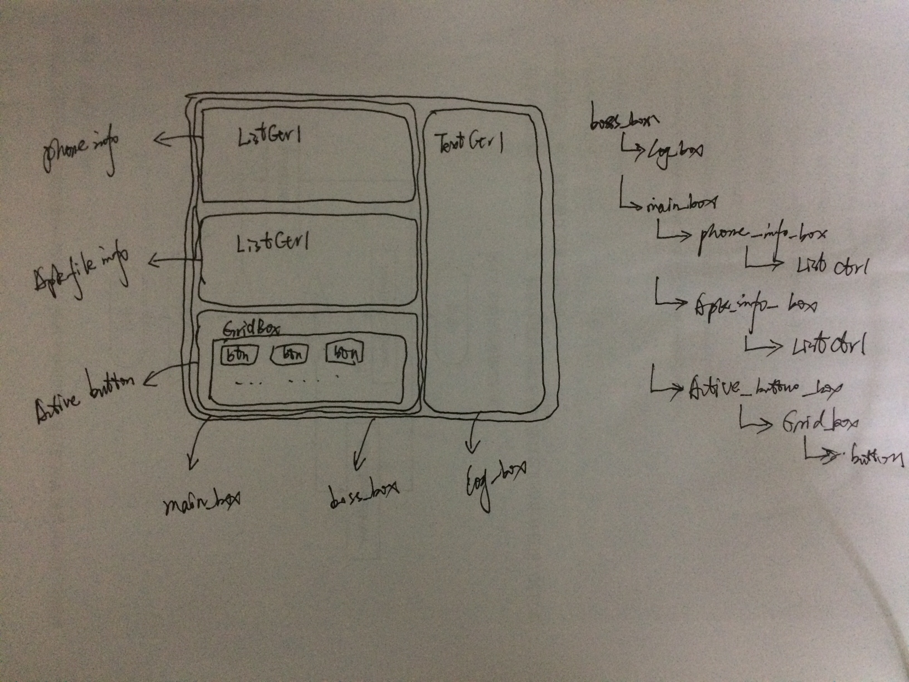
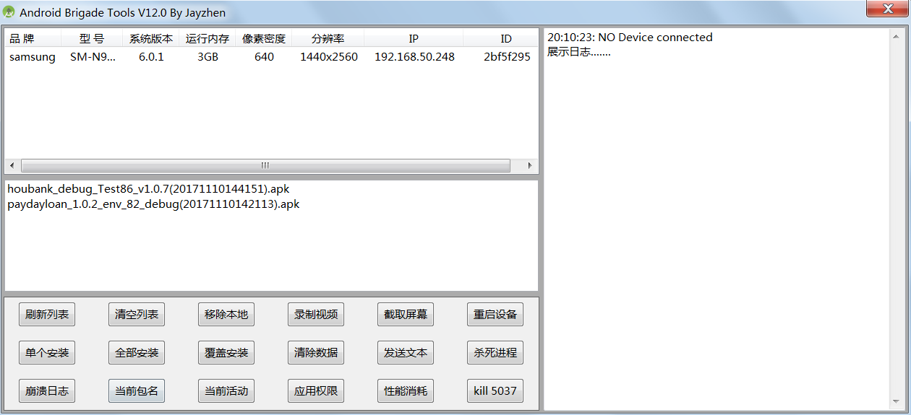

# 设计


# 实现


**注意：修改模块名后，记得将类中的import修改，还要清除一下原先编译好的pyc文件**

技术实现所使用到的python模块：<br>
   > 1. time<br>
    2. re<br>
    3. easygui   (0.98.0)（三方） >pip install easygui 安装最新也行<br>
    4. wx        （3.0）三方）<br>
    5. os<br>
    6. bs4.BeaufulSoup (0.0.1)（三方）<br>
    7. urllib,urllib2,urlparse<br>
    8. requests (2.12.1)（三方）<br>
    9. pychartdir（）（三方）<br>
    10. _winreg 获取注册表信息<br>

ADB环境变量设置(android sdk)： <br>
   > 1. ANDROID_HONE:T:\Android\sdk <br>
     2. path:%ANDROID_HOME%\build-tools\24.0.1;%ANDROID_HOME%\platform-tools;%ANDROID_HOME%\tools; <br>

使用到的adb命令：
```
    1. adb devices  查看连接上电脑的所有手机设备
    2. adb -s sno shell cat /system/build.prop  通过查看手机系统文件查看设备信息
            ro.build.version.release=4.0.3(android版本
            ro.product.model=S2(手机型号)--
            ro.product.brand=Spreadtrum(手机品牌)
            ro.product.name=sp6825eb_7661plus(手机正式名称)
            ro.product.device=sp6825eb_7661（采用的设备）
            ro.product.board=sp6825eb_7661（采用的主板）
            ro.product.cpu.abi=armeabi-v7a（cpu的版本）
            ro.product.cpu.abi2=armeabi(CPU品牌)
            ro.product.manufacturer=Spreadtrum(手机制造商)
    3. adb -s %s shell getprop dhcp.wlan0.ipaddress 获取手机的ip地址
    4. adb -s %s shell getprop ro.sf.lcd_density   获取手机的dpi值
    5. adb -s %s shell wm size 获取手机的分辨率
    6. adb install packagename  安装文件
    7. adb uninstall packagename  卸载文件
    8. adb shell pm list packages  显示已安装的所有安装包（包括系统和第三方）
    9. adb shell pm clear packagename  清除应用的数据（初始化）
    10. aapt dump badging package_name 查看apk文件的信息（包名、app名、启动的activity、app所需权限）
    11. adb shell input text "string"
        输入很长的字符,特殊字符，使用adb shell input 的时候会出问题  例如 特殊字符“&”
        此时有两种方法：
        1.使用转意符,就能正常输入了
          adb shell input text "\&" #该命令执行后，手机文本输入框中就会有“&”
          缺点：每个“&”前都要加一个转意符，否则会报错
          例如： adb shell input text "\&dd&&" ，会报错
        2.加一个空格字符前加一个空格，后面跟多少个特殊字符（&）都无所谓 adb shell input text " &&&&&&&hhd&&"
        综上可以看出，adb shell input text中空格和'\'都是有特殊含义的
        如果想在手机的编辑框中输入一个空格怎么办，这个就不能用 adb shell input text命令了
        直接用 adb shell input  keyevent  62 就好了
        输入'\'这个暂时没有好方法，adb shell input text " \h"  可以直接输入“\h”, 但是没有h，会报错
        如果有好的方法欢迎补充
        这个在输入网址的时候比较有用，尤其是url中的参数
    12. adb shell cat cat /proc/meminfo 查看手机的运存大小（四舍五入：int(round(x))或int(2*x)/2+int(2*x)%2）
        adb shell busybox free
    13. adb shell dumpsys dropbox | findstr data_app_crash 查看崩溃的日志
        adb shell dumpsys dropbox --print  time 打印崩溃日志详细内容
    14. adb shell screenrecord --time-limit %d /data/local/tmp/screenrecord.mp4 录制屏幕
    15. adb shell /system/bin/screencap -p /sdcard/screenshot.png 截取屏幕
    16. adb shell dumpsys package %s | findstr android.permission 查看应用程序所需系统的权限
```


# 需求：

## 第一版：2016.7
    1.实现获取网页并下载网页中的apk文件（爬虫技术）。
    2.连接手机，并将下载的apk文件安装到手机上。

## 第二版：2016.8
    1.在第一版的基础上，实现gui界面。
    2.在gui界面上展示设备信息和apk文件列表。

## 第三版：2016.9
    1.添加button按钮能够刷新设备信息。
    2.添加按钮下载按钮。
    3.添加刷新按钮。

## 总结：
    1.针对需求，首先是先实现相应的功能，随后在使用三方的桌面设计库再进行界面可视化设计。
    2.编程过程中有遇到技术上的问题，如：文件夹的更新。
    3.技术优化：可以使用多线程机制来消除ANR现象。
    4.功能还可拓展，如：内存的监控，耗时，monkey执行和日志分析等。
    5.adb环境下的功能有很多都集成在ddms工具中，想方便日常工作，可以继续设计需求并实现。
    6.可以将一些常量进行文件化配置。

## 第四版修改需求：2016.10
    1.可以有覆盖安装
    2.修改获取手机分辨率的方式
    3.下载时提示apk包的时间（页面获取的时间，将时间添加到文件名中）
    4.修改gui显示界面的布局（原先是上下俩个box，下面有分为左右box;现修改为上中下三个box

## 第五版修改需求： 2016.10
    1.添加截图功能
    2.使用requests替换urllib

## 第六版修改需求： 2016.10
    1.使用subprocess.Popen代替os.popen
    2.添加crash log抓取
    3.添加当前app包名
    4.添加当前app activity
    5.修复一些bug

## 第七版修改需求： 2016.11
    1.删去“下载”
    2.添加录制视频功能
    3.添加强制关闭进程的功能
    4.查看app的应用所需的系统权限
    5.添加cpu监控和内存消耗监控形成png图片（基本实现，以后优化）#需要安装pychartdir第三方库

## 第八版修改需求：2017.02.13  已完成
    1.收集设备的信息（具体信息待定） 20170228
    2.发送命令并打印结果
    3.向手机中发送文件和删除文件
    4.添加手机运行内存项    20170225
	
## 第九版修改需求：2017.05.09  已完成
	1.修改获取手机运行内存的计算方式
	2.修改了获取app权限的方式（为获取当前运行的app的系统使用权限）
	3.修改获取手机分辨率的方式

## 第十版修改需求：2017.05.21 已完成
    1.修改部分model文件的命名方式
    2.将原来的wx.dialog界面显示换成wx.frame,界面不可设置大小，只有关闭按钮
    3.添加listctrl手机信息的右键菜单操作，dump和print功能

## 第十一版修改需求：2017.07.07 已完成
    1.添加窗口的角标和任务栏图标
    2.添加一个textCtrl富文本控件动态显示日志
    3.使用wx.LogMessage()来打印日志
    4.修改录屏的路径bug(使用_winreg来获取pc的桌面路径然后将文件放到桌面)
    5.改造生成性能结果图片的方法
    6.使用独立线程去处理手机CPU和内存的收集任务(抽离线程进行工厂化，低耦合)

## 第十二版修改需求：2017.07.19   待完成
    1.完善Android移动设备的专项测试信息手机功能（启动时间、内存、cpu、耗电量、流量、流畅度） （将在web项目中完成）
    2.将录制视频的流程优化为使用线程机制  (已完成)
    3.启动并指定浏览器访问某一个网址（这个功能等价于使用爬虫下载网页中的文件）  （弃用方法）
    4.将专项测试收集的数据生成图片（将生产图片的方法抽离成一个独立的类）  （已完成）
    5.所有涉及系统输出重要数据，进行模型化
    6.环境独立化  （将在web项目中完成）
    7.功能接口化  （将在web项目中完成）
    9.优化全局的文件路径的获取方式，可配置 (已完成)

# 总结：

 1.有是一波总结，这次感觉会比第一次总结好点，至少轮子造完了。。。

## 第十三版修改需求：20170902
    1.舍弃当初为了比较easygui和wx的需求，用wx.MessageDailog替换easygui.msgbox